# 國立臺東大學 2024 年物聯網課程期末專案

<div style="background-color: #f8d7da; border: 1px solid #f5c6cb; color: #721c24; padding: 15px; margin-bottom: 20px; border-radius: 5px;">
  <strong>⚠️ 警告：</strong> 此專案中使用的圖片均為 AI 生成，僅供展示用途。
</div>

## Hikari 虛擬智能 AI 助理


## Table of Contents

- [專案簡介](#專案簡介)
- [需求定義](#需求定義)
- [使用模組](#使用模組)
- [技術實現](#技術實現)
  - [喚醒詞偵測](#喚醒詞偵測)
  - [Node-Red 顯示](#node-red-顯示)
- [虛擬助理套件整合](#虛擬助理套件整合)
- [使用方式](#使用方式)
- [影片展示](#影片展示)


### 專案簡介

小光（Hikari）是一個功能強大的 AI 助理，她能播放音樂、控制燈光、提供天氣資訊、設置鬧鐘，並提醒你喝水和起來活動。除此之外，小光還能幫你 Google 問題答案，遠端控制燈光，自動完成睡覺流程，記錄 GPS 路徑，並用鬧鐘音樂叫你起床。小光是你日常生活中最可靠的智能助手和聊天夥伴。我們希望使用者可以在不需要複雜操作的情況下，僅需使用自然語言對話即可控制服務及家中設備。

小光ひかり（Hikari），這個名字在日文中代表著「光」。取這個名字的原因是因為「光」象徵著指引、溫暖和希望。作為一個智能助手，小光的目標是為使用者提供便利，提升生活質量，並在各種情境下給予支持和幫助。這個名字恰如其分地反映了她希望在使用者的日常生活中，像光一樣，帶來正面、積極的影響，照亮每一個需要幫助的時刻。

### 需求定義

在日常生活中，我們經常需要記錄待辦事項、設置鬧鐘、控制家電、查看天氣時間等。這些雖然是小事，但在無形之中卻耗費我們許多時間。尤其是對於現今的獨居高齡族群來說，他們可能因為行動不便或記憶力衰退而面臨更多挑戰，例如迷路的風險。此外，他們也需要與他人互動和聊天，以減少孤獨感。

<p align="center">
  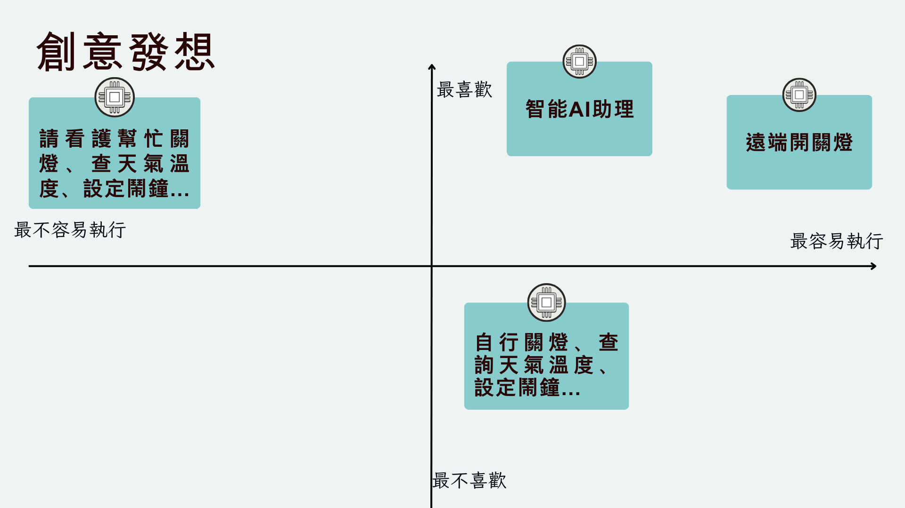
</p>

### 使用模組

- ESP32E 8M 開發板
- MAX9814 麥克風放大器模組
- RGB-LED 燈
- 蜂鳴器
- ESP8266 開發板
- SSD1306 OLED 顯示螢幕
- NEO-8M GPS 模組
- GY-521 三軸加速度陀螺儀
- lcd1602 顯示螢幕
- MICRO SERVO 9G SG90
- 溫濕度感測器

<div align="center">
  <table border="1" cellspacing="0" cellpadding="10">
    <tr>
      <td align="center" style="border: 1px solid;">
        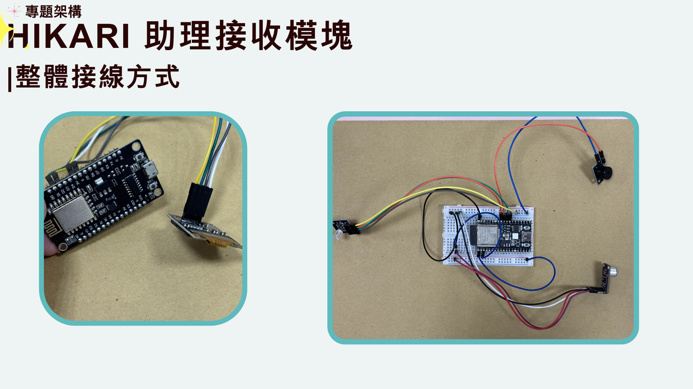
      </td>
      <td align="center" style="border: 1px solid;">
        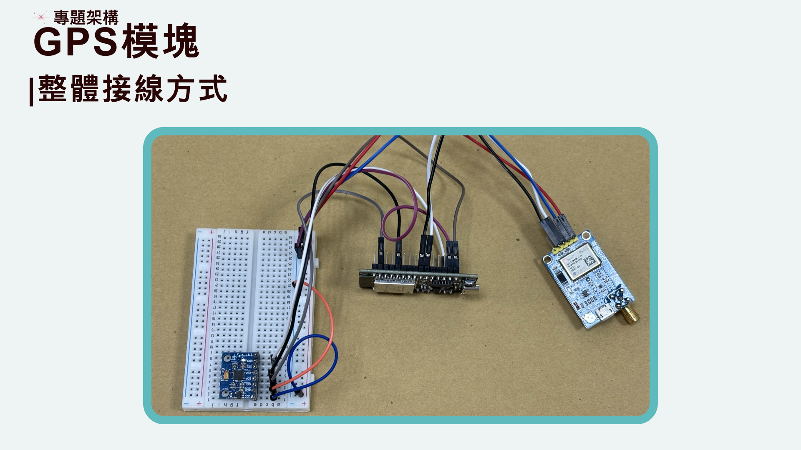
      </td>
      <td align="center" style="border: 1px solid;">
        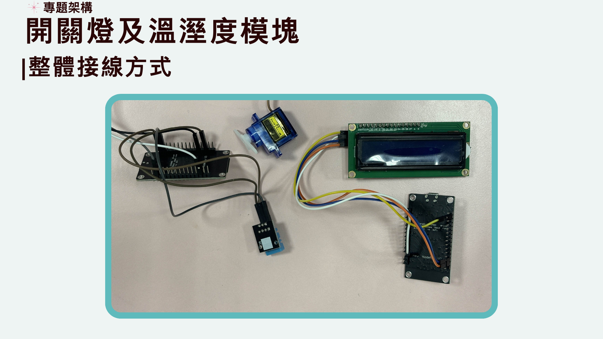
      </td>
    </tr>
    <tr>
      <td align="center" style="border: 1px solid;">
        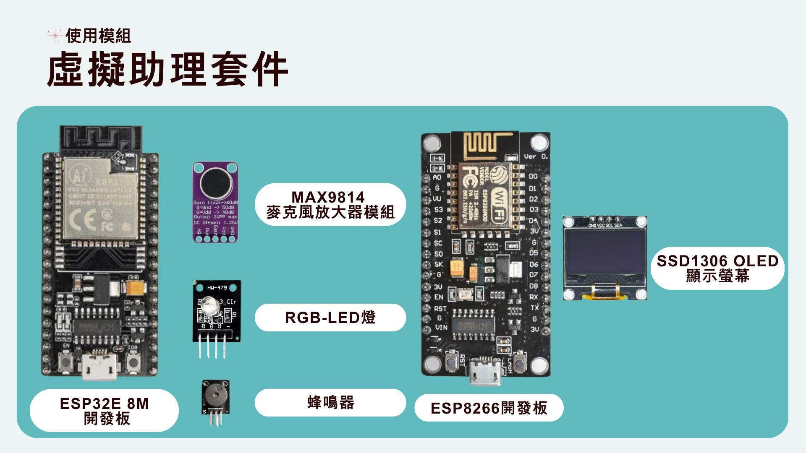
      </td>
      <td align="center" style="border: 1px solid;">
        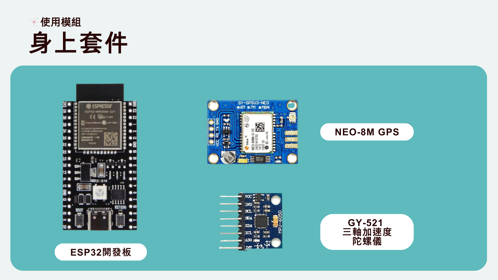
      </td>
      <td align="center" style="border: 1px solid;">
        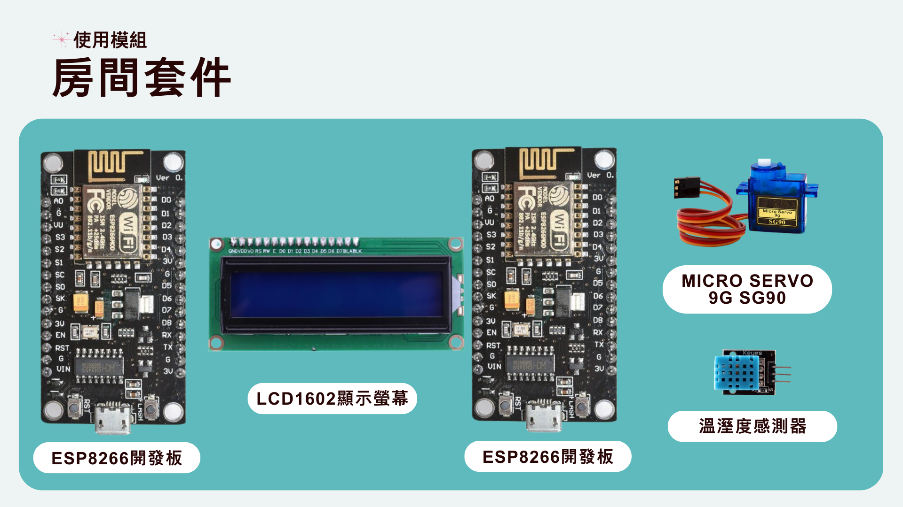
      </td>
    </tr>
  </table>
</div>


### 技術實現（介紹部分）

#### 喚醒詞偵測

- 使用開源專案：openWakeWord，自行訓練 ‘Hey Hikari’ 喚醒詞（模組位置在 model/hey_Hikari.onnx）
- 由於 ESP32 的效能無法成功在其自身上運行喚醒詞偵測，我們的做法是將 ESP32 上麥克風讀取到的數值傳送到我們的 Server，在 Server 中進行喚醒詞偵測（將 MAX9814 麥克風的數值當作 Windows server 的預設麥克風）。
- 喇叭實現方法：由於我們購買的喇叭和放大器模組未能正常運作，我們架設了一個 web server，使用手機來獲取語音助理的音訊。
- 由於 MAX9814 聲音質量較差，喚醒詞偵測難以辨識，我們先對音訊流進行簡單降噪，使其能夠被喚醒詞偵測偵測，並自動錄製錄音。之後再使用 denoiser 模型進行強力降噪，提升 TTS 準確率。

### Node-Red 顯示

#### Google Map & Node-red UI

<div align="center">
  <table border="1" cellspacing="0" cellpadding="10">
    <tr>
      <td align="center" style="border: 1px solid;">
        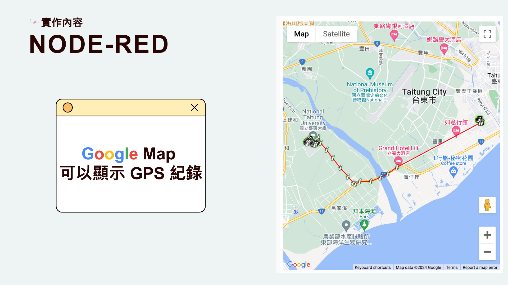<br>
        <span style="border-top: 1px solid; display: block;">顯示 GPS 紀錄</span>
      </td>
      <td align="center" style="border: 1px solid;">
        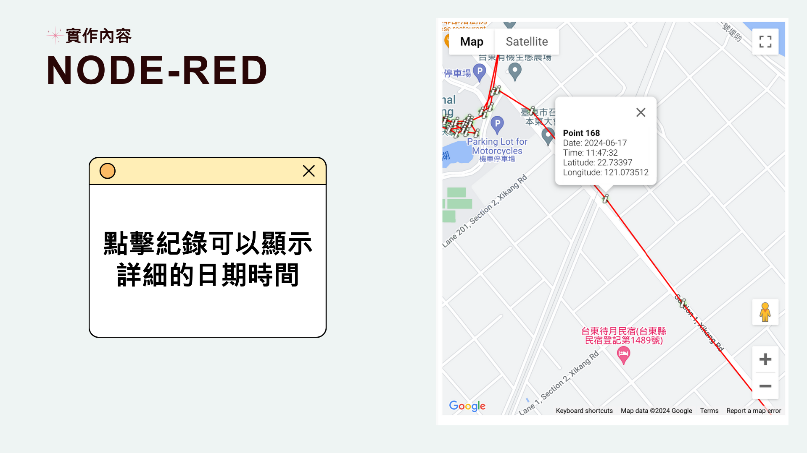<br>
        <span style="border-top: 1px solid; display: block;">點擊紀錄可顯示詳細的日期時間</span>
      </td>
      <td align="center" style="border: 1px solid;">
        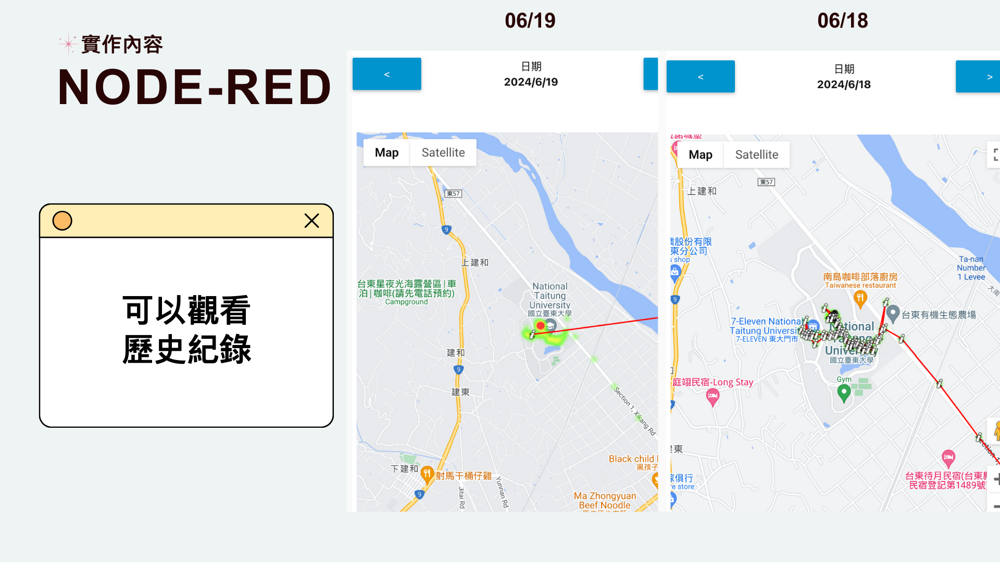<br>
        <span style="border-top: 1px solid; display: block;">可以觀看歷史紀錄</span>
      </td>
    </tr>
    <tr>
      <td align="center" style="border: 1px solid;">
        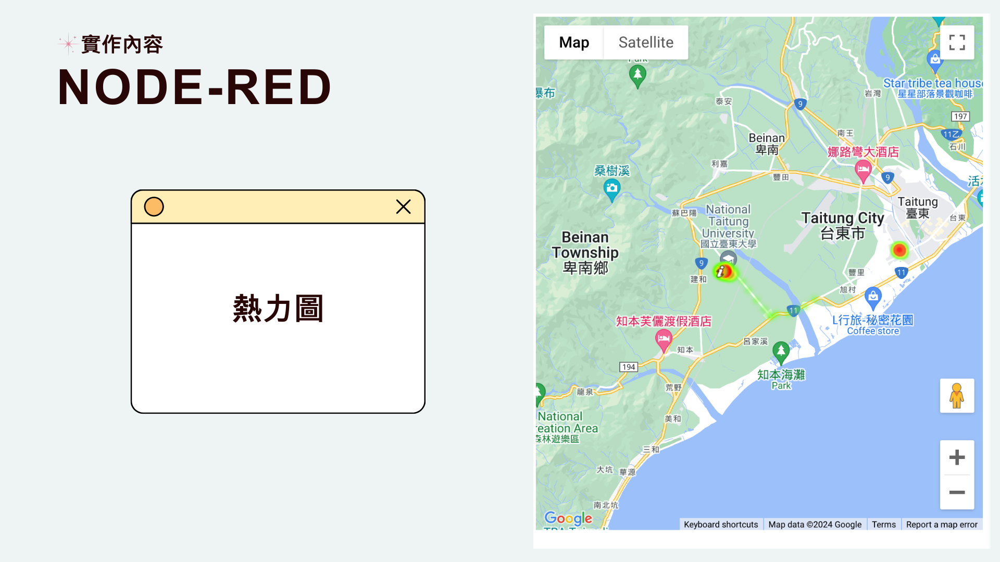<br>
        <span style="border-top: 1px solid; display: block;">熱力圖</span>
      </td>
      <td align="center" style="border: 1px solid;">
        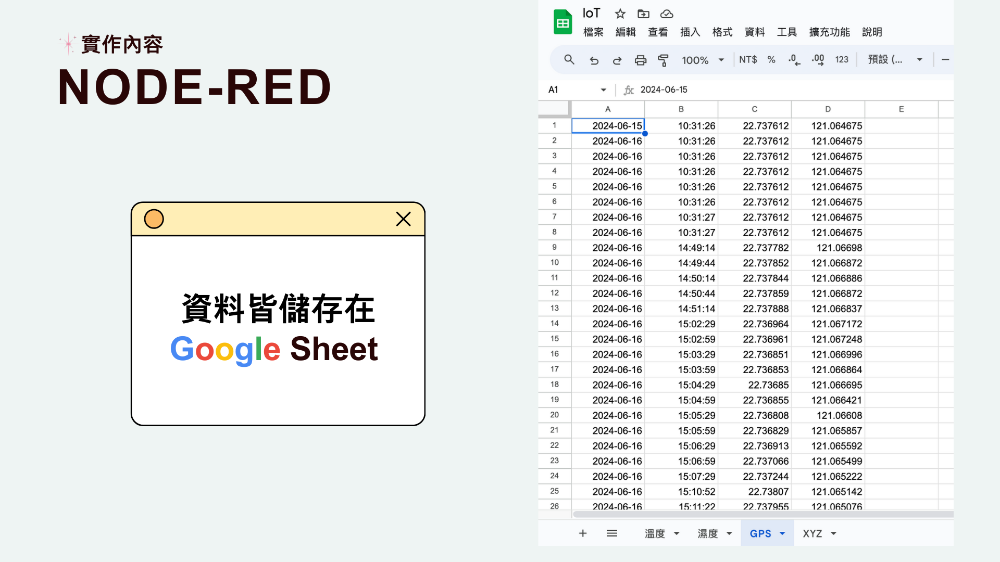<br>
        <span style="border-top: 1px solid; display: block;">資料儲存在 Google Sheet 中</span>
      </td>
      <td align="center" style="border: 1px solid;">
        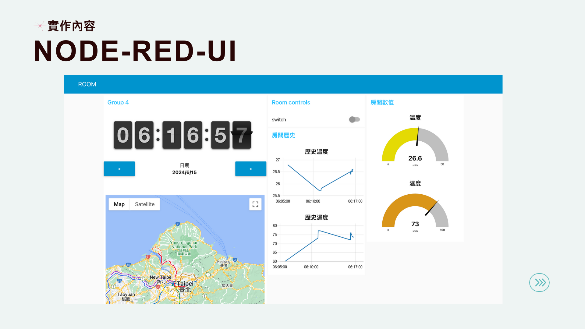<br>
        <span style="border-top: 1px solid; display: block;">Node-Red-UI</span>
      </td>
    </tr>
  </table>
</div>


### 虛擬助理套件整合

<div align="center">
  <table border="1" cellspacing="0" cellpadding="10">
    <tr>
      <td align="center" style="border: 1px solid;">
        <br>
        <span style="border-top: 1px solid; display: block;">虛擬助理套件整合</span>
      </td>
      <td align="center" style="border: 1px solid;">
        <br>
        <span style="border-top: 1px solid; display: block;">虛擬助理工具介紹</span>
      </td>
      <td align="center" style="border: 1px solid;">
        <br>
        <span style="border-top: 1px solid; display: block;">虛擬助理套件介紹</span>
      </td>
    </tr>
    <tr>
      <td align="center" style="border: 1px solid;">
        <br>
        <span style="border-top: 1px solid; display: block;">額外套件整合</span>
      </td>
      <td align="center" style="border: 1px solid;">
        <br>
        <span style="border-top: 1px solid; display: block;">GPS 套件介紹</span>
      </td>
      <td align="center" style="border: 1px solid;">
        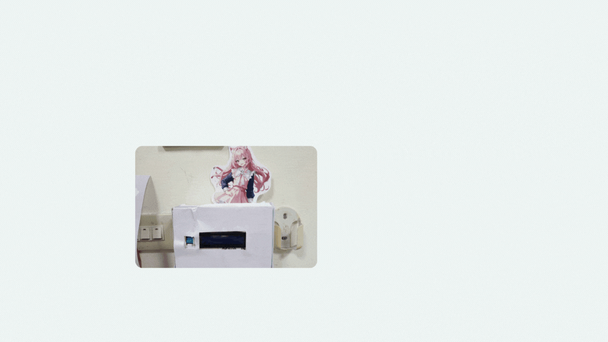<br>
        <span style="border-top: 1px solid; display: block;">室內套件整合</span>
      </td>
    </tr>
    <tr>
      <td align="center" style="border: 1px solid;">
        <br>
        <span style="border-top: 1px solid; display: block;">室內套件介紹</span>
      </td>
    </tr>
  </table>
</div>


### 使用方式

目前僅支援 Windows 系統

1. 安裝 Python 12 版本以上（為了用 openai python 套件）
2. 安裝 `requirements.txt`
3. 創建 `.env` 文件，並填入以下內容：
```text
OPENAI_API_KEY=
WEATHER_API_KEY=
google_search_api_key=
GOOGLE_MAP_API_KEY=
```

- 天氣 API 使用中央氣象署的 API：https://opendata.cwa.gov.tw/index

4. 啟動 `run_all_server.bat`
5. 另啟動 TTS API，本專案使用 [GPT-SoVITS](https://github.com/RVC-Boss/GPT-SoVITS)
6. 使用手機或其他可上網設備，開啟 [http://localhost:5000/](http://localhost:5000/) （至少要在上面播放一次內容即可關閉手機螢幕，他將會作為設備的輸出）

## 影片演示

[](https://youtu.be/GoFSc7Lh8e0?si=A5YrJNk4vY3y0VHc)

## 本專案簡報PPT

[點擊這裡查看簡報（Canva）](https://www.canva.com/design/DAGIXWOO42c/V6Oqh3WmXknl4c0JKcM83w/view?utm_content=DAGIXWOO42c&utm_campaign=designshare&utm_medium=link&utm_source=editor)

### TODO:
### Arduino 端

程式碼尚未整理完成

### Arduino 端

Node-red，整理完後會把 work flow 放上來